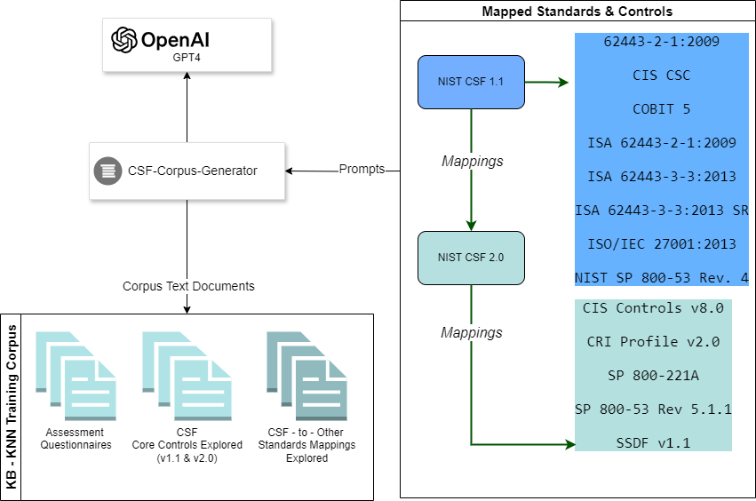

# CSF Corpus Builder ChatGPT Client


**Description**:  

Go command-line utility leveraging OpenAI - ChatGPT4 to generate a corpus of: assessment questionnaires, guideline and implementation documentation covering NIST CSF 2.0 and related standards and controls.

The [Generated Corpus](./corpus/README.md) is used in other CSF KB - KNN utilities for building and training models addressing a variety of Cybersecurity compliance use-cases including:

1. Training domain specific models and KBs that would allow mapping between different standards
2. Generating questionnaires for compliance assessment for all applicable standards.
3. To build knowledge-bases, supporting graph-based inferences for tracing continuity and coverage between published CSF versions and mapped standards.

**Status**:  Baseline version 1.0



## Runtime Env and Dependencies
*Tested on*: Ubuntu 22.04 - *Golang Version*: 1.22.1 

*Requires:* Go version 1.18 or greater

Active [OpenAI API](https://platform.openai.com/) subscription allowing access to GPT 3.5+ (More on creating API keys at: [Go-OpenAI](https://github.com/sashabaranov/go-openai?tab=readme-ov-file#getting-an-openai-api-key) https://github.com/sashabaranov/go-openai?tab=readme-ov-file#getting-an-openai-api-key

## Configuration

###### ChatGPT API Connectivity

The utility expects the following environment variables to be set:

```bash
export OPEN_API_SECRET=<YOUR-OPEN-API-SECRET>
export OPEN_API_ORGID=<YOUR-OPEN-API-ORGID>
```

###### Corpus Generation Settings

Sample configuration is available at: `./config/.env`

```config
# Prompt generation per control
INPATH_QUERY_ASSESS=model/controls/csf-core-v2.0.controls.txt
INPATH_QUERY_CSF=model/maps/csf-core-v2-map.txt
INPATH_QUERY_MAP=model/maps/map.csf-v2.0.txt
# Corpus Out locations
OUTPATH_ASSESS=corpus/assess
OUTPATH_CSF=corpus/csf-core
OUTPATH_MAP=corpus/map-v2.0
# Go routine Workgroup settings to work around ChatGPT API access limitations
API_BATCH_SIZE=10
API_WAIT_SECONDS=60
```

## Usage

Having all corpus generation options are captured in the `./config/.env` as explained above:

+ Generate assessment queries for Standard Controls:        `go run main.go -qtype=assess`
+ Generate general guidance and implementation documentation for CSF  (v 1.1 and 2.0): `go run main.go -qtype=csf`
+ Generate general guidance and implementation documentation for explicitly mapped standards:  `go run main.go -qtype=map`

## Testing

Rudimentary testing provided with Golang `go test`

## Features to Implement & Known issues

- Extending configuration to specify a GPT version
- Dockerized version for the CLI

## Getting help

If you have questions, concerns, bug reports, etc, please file an issue in this repository's Issue Tracker.

## Open source licensing info
1. [LICENSE](LICENSE)

----
## Credits and references

#### [Go OpenAI](https://github.com/sashabaranov/go-openai)

[](https://pkg.go.dev/github.com/sashabaranov/go-openai) [](https://goreportcard.com/report/github.com/sashabaranov/go-openai) [](https://codecov.io/gh/sashabaranov/go-openai)

Unofficial Go clients library for [OpenAI API](https://platform.openai.com/). 

#### [CSF Tools](https://csf.tools/) 

Exploration and Visualization Tools by NIST Cybersecurity Framework (CSF) and Privacy Framework (PF)

